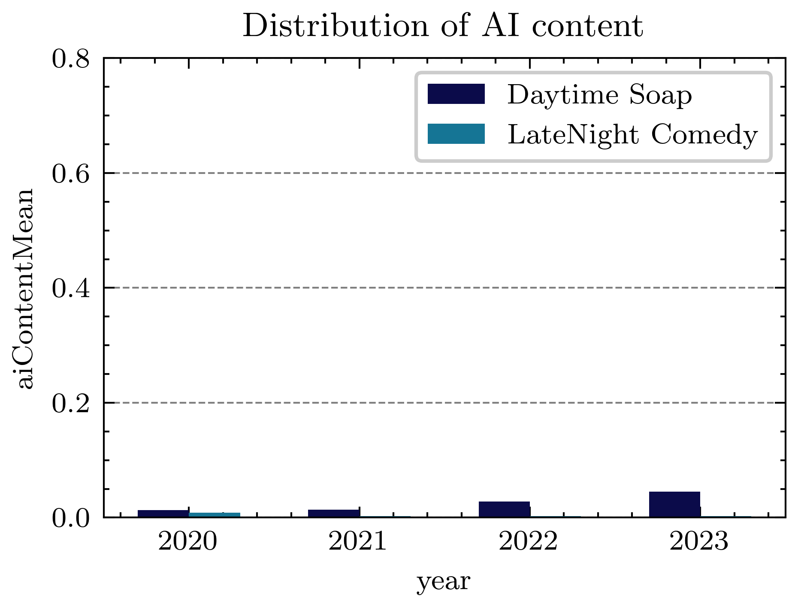
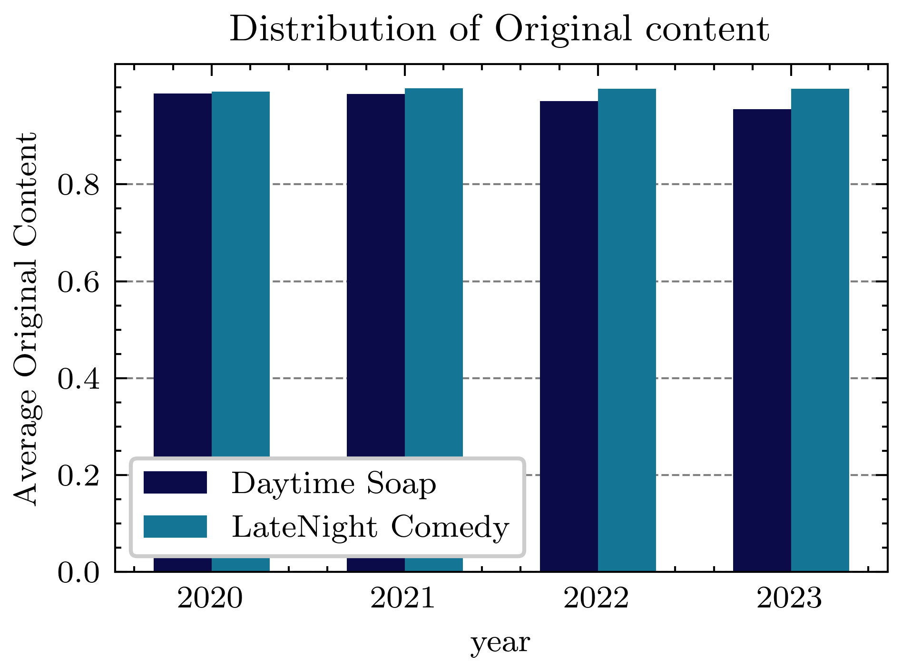

# AI Content in Hollywood scripts

## Overview

The purpose of this study was to determine the impact of AI generated content on US TV screen-
plays.

## Methodology

- 6K transcripts of daytime and SNL episodes were collected.
- After cleaning and filtering, 3.8K records were processed through Originality AI’s Detection model.
- Visual and statistical analysis was carried out on the data, and conclusions drawn from the observations.

## Key Findings:

- Low probability of AI Content in scripts.
- Episodes written after the strike started (by non-union workers) showed no variation from this trend.

## Credit

The transcripts were collected from the following fan-hosted websites:
• https://tvmeg.com/ - for Daytime Soap Operas
• https://snltranscripts.jt.org - for SNL Sketches
• https://sites.google.com/site/tvwriting/us-drama/pilot-scripts - for US Drama/Comedy Pi-
lots

Thank you
